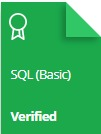

### 			Hi there, I'm [Abhishek garg](https://iamabhishekgarg.tech) </align>
 &nbsp;&nbsp;Connect with me

  

<!-- 

 -->

 

- 🔭 I’m currently working on [Node.js](https://github.com/iamabhishekgarg/crudapiforemp_js)
- 🌱 I’m currently learning Javascript  and Python
- 💬 Ask me about HTMl, javascript,CSS and Django,PHP,Wordpress 
- 📫 How to reach me:[@Abhishek Garg](https://iamabhishekgarg.tech/)

## HackerRank Certificates

				

## Technologies I have used

<table >
<tr align="center">
<td >

</td>
<td >

		</td>
		<td >
			
		</td>
		<td >
			
      </td>
		<td >
          
      </td>
      <td>
         
      </td>
           <td>
         
      </td>
      <td>
         
      </td>
      <td>
         
      </td>
	</tr>
	<tr align="center">
		<td>Node.js</td>
		<td>Next.js</td>
		<td>Visual Studio Code.</td>
		<td>Html</td>
		<td>Css</td>
		<td>js</td>
		<td>Sql</td>
		<td>MySql</td>
		<td>git</td>
		<td>github</td>
		<td>Terminal</td>
	</tr>
</table>
<table >
	<tr align="center">
		<td>
			
		</td>
		<td >
			
		</td>
		<td >
			
		</td>
		<td >
			
		</td>
		<td>
 		
      		</td>
   		   <td>
    		     
 		     </td>
	</tr>
	<tr align="center">
		<td>Material-UI</td>
		<td>Bootstrap</td>
		<td>AWS S3</td>
		<td>MongoDB</td>
				<td>SqlDB</td>
						<td>MysqlDB</td>
	</tr>
</table>

---

##  See my projects - [Abhishek garg/projects](https://iamabhishekgarg.tech/#portfolio)
